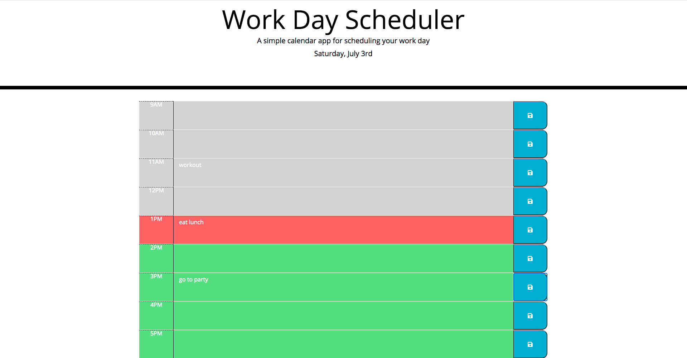

# work-day-scheduler

## Description

The purpose of this project was to create a day scheduler that allows a yser ti save events for each hour of the day. The current date is displayed at the top of the calendar and the time blocks included are for standard business hours 9-5. The timeblocks are coded color, past is gray, present is red, future is green. When the save icon is pressed, it saves the event to local storage and it is still there if you refresh the page. This project utilizes HTML, CSS, jQuery and I used the Moment.js library for the date and times.

## Links
- [Deployed Website](https://erinlim2001.github.io/work-day-scheduler/)
- [Code Repository](https://github.com/erinlim2001/work-day-scheduler)

## Installation

1. Clone the repository using "git clone" followed by the SSH key or HTTPS 
2. It will contain an index.html file, a README.md, style.css, and a script.js file.

## Usage

You will be able to view the website on a desktop web browser once it is deployed.

Desktop Screen:

## Credits

### Tutorials Used
* [https://momentjs.com/docs/](https://momentjs.com/docs/)
* [https://api.jquery.com/parent/](https://api.jquery.com/parent/)

## Bugs 

You must press the save icon to save the text you put in planner, just pressing the blue parts of the button will not save the content if you refresh.

## License

MIT License

Copyright (c) 2021 Erin Lim

Permission is hereby granted, free of charge, to any person obtaining a copy
of this software and associated documentation files (the "Software"), to deal
in the Software without restriction, including without limitation the rights
to use, copy, modify, merge, publish, distribute, sublicense, and/or sell
copies of the Software, and to permit persons to whom the Software is
furnished to do so, subject to the following conditions:

The above copyright notice and this permission notice shall be included in all
copies or substantial portions of the Software.

THE SOFTWARE IS PROVIDED "AS IS", WITHOUT WARRANTY OF ANY KIND, EXPRESS OR
IMPLIED, INCLUDING BUT NOT LIMITED TO THE WARRANTIES OF MERCHANTABILITY,
FITNESS FOR A PARTICULAR PURPOSE AND NONINFRINGEMENT. IN NO EVENT SHALL THE
AUTHORS OR COPYRIGHT HOLDERS BE LIABLE FOR ANY CLAIM, DAMAGES OR OTHER
LIABILITY, WHETHER IN AN ACTION OF CONTRACT, TORT OR OTHERWISE, ARISING FROM,
OUT OF OR IN CONNECTION WITH THE SOFTWARE OR THE USE OR OTHER DEALINGS IN THE
SOFTWARE.